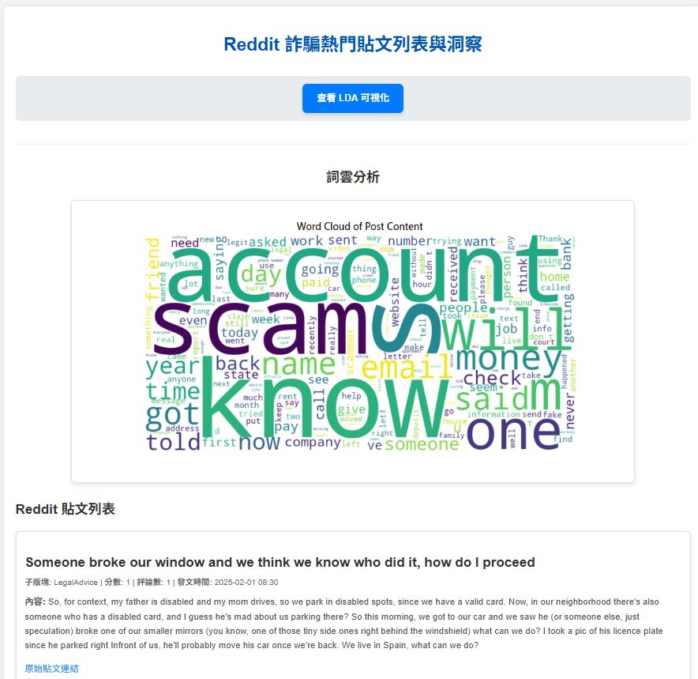
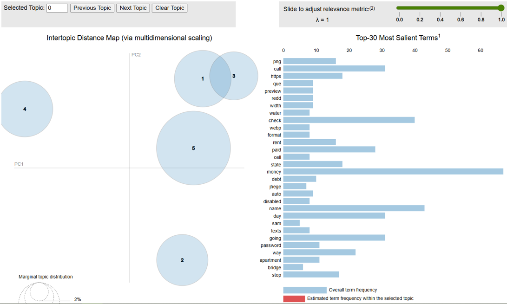

# Reddit 詐騙貼文平台
這是一個基於 Django 的 Web 應用程式，旨在透過 Reddit API 獲取相關貼文，並對詐騙議題進行深度分析，提供關鍵數據洞察。

## 功能概覽 (Features)

* **Reddit 貼文列表：** 呈現從 Reddit API 即時獲取並整理的最新詐騙相關貼文。
* **詞雲分析：** 將所有貼文內容的熱門關鍵字視覺化，直觀呈現詞語頻率與重要性。
* **LDA 主題模型可視化：** 運用潛在狄利克雷分配 (LDA) 演算法，揭示貼文中的潛在主題結構及其分佈，提供數據驅動的洞察。
* **Django 框架構建：** 整個應用程式使用高效且安全的 Django 框架進行開發。
* **Render 部署：** 應用程式已成功部署至 Render 雲端平台，提供穩定的線上服務。

## 技術棧 (Tech Stack)

* **後端:** Python, Django, Gunicorn, WhiteNoise
* **資料庫:** PostgreSQL (用於生產環境) / SQLite (用於本地開發)
* **資料分析/處理:** NLTK, Gensim, WordCloud, Matplotlib
* **部署:** Render
* **版本控制:** Git
* **前端:** HTML, CSS (透過外部 `styles.css` 加載)

## 未來改進 (Future Improvements)

* 增加用戶互動功能，允許用戶根據子版塊 (subreddits) 進行貼文篩選，以提供更精準的數據檢視。
* (您可以考慮添加更多想法，例如：增加更多數據可視化圖表、實施用戶身份驗證、加入新數據源等)